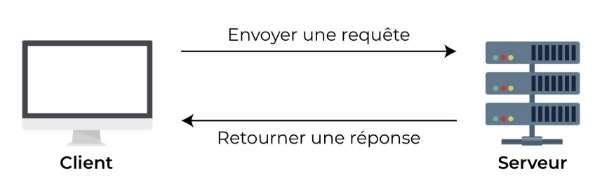
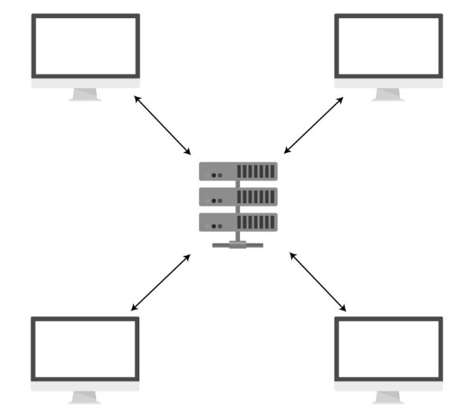

# Introduction

API est une abbréviation et signifie Application Programming Interface (ou interface de programmation d’application, en français). Pour faire simple : c’est un moyen de communication entre deux logiciels, que ce soit entre différents composants d’une application ou entre deux applications différentes.

Prenons l’exemple d'Air France, une compagne aérienne française. Quelque part dans le monde, les serveurs d'Air France ont accès à toutes les données que vous voulez voir pour un trajet Paris-Lisbonne : les différents avions, les tarifs, les statuts des vols, etc. Pour que vous puissiez y avoir accès, votre navigateur (que l’on appelle le client) doit recevoir ces informations de quelqu’un.

Ce quelqu’un, c’est le serveur. L’application doit avoir une conversation avec le serveur.



C’est ce qu’on appelle la communication entre client et serveur : le client formule une requête (ou une demande) pour obtenir une information et le serveur envoie une réponse contenant les données demandées si cela est possible.


En web, un service web et une API sont tous les deux des moyens de communication. Un service web standard facilite seulement la communication entre deux machines via un réseau. Une API facilite l’interaction entre deux applications différentes afin qu’elles puissent communiquer entre elles : elle sert d’intermédiaire. Le client va demander à l’API une information, celle-ci va aller chercher cette information dans la base de données puis la renvoyer au client dans un second temps.

Les API permettent la communication entre de nombreux composants différents de votre application, mais aussi entre des composants de votre application et d’autres développeurs. Elles agissent ainsi comme un intermédiaire qui transmet des messages à travers un système de requêtes et de réponses.

REST signifie Representational State Transfer (ou transfert d’état de représentation, en français), et constitue un ensemble de normes, ou de lignes directrices architecturales qui structurent la façon de communiquer les données entre votre application et le reste du monde, ou entre différents composants de votre application.

Nous utilisons l’adjectif RESTful pour décrire les API REST. Toutes les API REST sont un type d’API – mais toutes les API ne sont pas RESTful !

## Client-serveur separation

L’une des normes de REST est la séparation du client et du serveur. Nous avons un peu abordé la question des clients et des serveurs dans le chapitre précédent, il est temps d’approfondir un peu le sujet !

Un client est celui qui va utiliser l’API. Cela peut être une application, un navigateur ou un logiciel.

Un serveur est un ordinateur distant capable de récupérer des données depuis la base de données, de les manipuler si besoin et de les renvoyer à l’API, comme ce gros ordinateur au milieu.



De façon générale, il existe une séparation entre le client et le serveur. Cette séparation permet au client de s’occuper uniquement de la récupération et de l’affichage de l’information et permet au serveur de se concentrer sur le stockage et la manipulation des données.

## Stateless

L’un des autres aspects uniques des API REST est qu’elles sont stateless – sans état, en français – ce qui signifie que le serveur ne sauvegarde aucune des requêtes ou réponses précédentes.

Étant donné que chaque message est isolé et indépendant du reste, il vous faudra vous assurer d’envoyer avec la requête que vous formulez toutes les données nécessaires pour être sûr d’avoir la réponse la plus précise possible.

Le fait d’être stateless rend chaque requête et chaque réponse très déterminée et compréhensible.

## Cacheable (ou sauvegardable, en français)

La réponse doit contenir l’information sur la capacité ou non du client de mettre les données en cache, ou de les sauvegarder. Si les données peuvent être mises en cache, la réponse doit être accompagnée d’un numéro de version. Ainsi, si votre utilisateur formule deux fois la même requête (c’est-à-dire s’il veut revoir une page) et que les informations n’ont pas changé, alors votre serveur n’a pas besoin de rechercher les informations une deuxième fois. À la place, le client peut simplement mettre en cache les données la première fois, puis charger à nouveau les mêmes données la seconde fois.

Une mise en cache efficace peut réduire le nombre de fois où un client et un serveur doivent interagir, ce qui peut aider à accélérer le temps de chargement pour l’utilisateur.

Vous avez peut-être entendu le terme cache en référence à, par exemple, « Rafraîchissez le cache de votre navigateur ». Un cache est un moyen de sauvegarder des données pour pouvoir répondre plus facilement aux prochaines requêtes qui seront identiques.

## Uniforme Interface (interface uniforme)

Lors de la création d’une API REST, les développeurs acceptent d’utiliser les mêmes normes. Ainsi, chaque API a une interface uniforme. L’interface constitue un contrat entre le client et le service, que partagent toutes les API REST. C’est utile, car lorsque les développeurs utilisent des API, cela leur permet d'être sûrs qu’ils se comprennent entre eux.

Une API REST d’une application peut communiquer de la même façon avec une autre application entièrement différente.

## Layered system (système de couches)

Chaque composant qui utilise REST n’a pas accès aux composants au-delà du composant précis avec lequel il interagit.

Cela signifie qu’un client qui se connecte à un composant intermédiaire n’a aucune idée de ce avec quoi ce composant interagit ensuite. Par exemple, si vous faites une requête à l’API Facebook pour récupérer les derniers posts : vous n’avez aucune idée des composants avec lesquels l’API Facebook communique..

Cela encourage les développeurs à créer des composants indépendants, facilitant le remplacement ou la mise à jour de chacun d’entre eux.

## FastApi

FastAPI est un framework Python moderne et puissant pour la création d'API web. Il se distingue par sa rapidité, sa facilité d'utilisation et sa capacité à gérer des charges de travail intensives. Voici quelques aspects positifs de FastAPI :

- Hautes performances : FastAPI est conçu pour être extrêmement rapide grâce à l'utilisation d'une technologie appelée "type hints" qui permet de générer automatiquement des validations de types et des conversions de données efficaces. Cela permet d'obtenir des performances similaires à celles d'un langage de programmation compilé comme Go.
- Documentation interactive : FastAPI propose une documentation interactive générée automatiquement à partir des annotations de type de votre code. Cela facilite grandement le processus de développement en permettant aux développeurs de tester directement les endpoints et d'obtenir des exemples de code pour chaque route de l'API.
- Support complet pour les standards modernes : FastAPI prend en charge nativement les normes modernes telles que OpenAPI (Swagger) et JSON Schema, ce qui facilite l'intégration avec d'autres outils et services. Vous pouvez générer automatiquement une documentation Swagger pour votre API, valider les données d'entrée et de sortie avec JSON Schema, et utiliser des outils tels que Swagger UI pour explorer et tester votre API.
- Intégration simple avec d'autres bibliothèques et outils : FastAPI peut être facilement intégré avec d'autres bibliothèques Python telles que SQLAlchemy pour l'accès à la base de données, Pydantic pour la validation des données, et OAuth pour l'authentification et l'autorisation. Il est également compatible avec les frameworks de test populaires tels que Pytest, ce qui facilite la création de tests unitaires et d'intégration.
- Écosystème actif : FastAPI bénéficie d'une communauté d'utilisateurs active et en croissance, ce qui signifie qu'il existe de nombreuses ressources, tutoriels et exemples disponibles en ligne. De plus, FastAPI est maintenu activement par ses créateurs et bénéficie de mises à jour régulières et d'améliorations continues.

## Installation

on suppose que vous êtes sur Ubuntu et que vous avez python d’installé :

- ```python -m venv .```
- ```source bin/activate```
- ```pip install fastapi```
- ```pip install uvicorn```
- ```touch main.py```
- ```python 
    from fastapi import FastAPI 
    app = FastAPI() 
    
    @app.get("/")
    def index():
        return "Hello world"

- ```uvicorn main:app --reload```

## Comprendre les requêtes

Nous avons fait notre première api, comme vous pouvez le voir il est très facile de créer une application avec fastapi. @app.get(“/”) sert à deux choses, la première et qu’elle précise que notre fonction et un get, la deuxième précise le endpoint de notre application.

Pour comprendre ce qu’est un get, il faut comprendre ce qu’est un CRUD


le CRUD est la liste des actions de base que vous pouvez effectuer sur une ressource. C’est un acronyme qui signifie Create (créer), Read (lire), Update (mettre à jour), et Delete (supprimer). Bien que le CRUD ne constitue pas vraiment un mécanisme technique en soi, chaque action CRUD est associée à un verbe HTTP.

La méthode que nous avons codée et une méthode get, elle permet la lecture, quand le client adressera une requête à notre API, il s’attendra à recevoir une réponse (ici ça sera hello world).


Une requête de manière générale est composée de plusieurs éléments :

Les verbes HTTP : Les verbes HTTP correspondent à différents types d’actions que vous pouvez accomplir avec votre requête. Ceux que vous rencontrerez le plus couramment sont GET (obtenir), PUT (mettre), POST (publier), et DELETE (supprimer).

L’URI : Un URI est le moyen d’identifier les ressources. Dans notre première application, il a la forme de “\”. On l’appelle également un endpoint ou encore le path

Un header (ou en-tête) : vous permet de faire passer des informations supplémentaires sur le message.

- De quel langage s’agit-il ?
- À quelle date l’envoyez-vous ?
- Quel logiciel la personne utilise-t-elle ?
- Quelle est votre clé d’authentification ?

Le body : Pour formuler une requête, il n’est utilisé qu’avec PUT (mise à jour) ou POST (création). Il contient les données réelles de la ressource que vous essayez de créer ou de mettre à jour. Les données sont envoyées sous format JSON.

Nous verrons ces concepts plus en détails lors de nos développements.

Un avantages de fastapi est la documentation automatique : exemple :

- format swagger : [http://localhost:8000/docs](http://127.0.0.1:8000/docs)
- format redoc : [http://localhost:8000](http://127.0.0.1:8000/redoc)

Essayons autre chose, nous allons ajouter à notre api un nouveau chemin :

```python
from fastapi import FastAPI

app = FastAPI()

@app.get("/")
def index():
    return "Hello world"

@app.get("/path")
def get_path():
    return "this is a path"

@app.post("/post_method")
def post_method():
    return "this is a post methode"
```
puis sur la bar de recherche :

- <http://localhost:8000/path>
- <http://localhost:8000/post_method>
