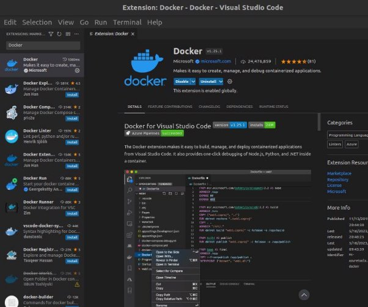

# Introduction

Ce cours à pour but d'être une initiation à docker pour les tâches courantes d'un data engineer, il n'est pas exhaustif il sera à l'attention du lecteur de chercher des ressources complémentaire si son poste lui exige.

Docker est une technologie qui permet de créer et d'exécuter des applications de manière isolée, indépendamment du système d'exploitation sous-jacent. Il fonctionne comme une sorte de conteneur virtuel, dans lequel vous pouvez empaqueter votre application et toutes ses dépendances. Ces conteneurs sont portables, légers et peuvent être exécutés sur n'importe quel ordinateur ou serveur équipé de Docker, sans se soucier des différences de configuration ou d'environnement.

En d'autres termes, Docker vous permet de créer des environnements d'exécution autonomes et cohérents pour vos applications, ce qui facilite le déploiement et la gestion de logiciels sur différents systèmes. Cela vous permet de résoudre des problèmes de compatibilité et d'isolation, en garantissant que votre application fonctionne de la même manière quel que soit l'endroit où elle est exécutée.

Il y a deux composant très important :

- Le conteneur : Docker est une plateforme qui utilise des conteneurs pour encapsuler des applications, tandis qu'un conteneur est l'unité d'exécution isolée qui contient l'application et ses dépendances. Docker facilite le processus de création, de déploiement et de gestion des conteneurs, ce qui en fait une solution populaire dans le domaine du développement logiciel et de la gestion des infrastructures.
- Image : Une image est un package ou une sorte de "photo" de l'état d'une application, comprenant tous les fichiers nécessaires à son exécution : le code source, les bibliothèques, les dépendances, les fichiers de configuration, etc. Une image est une représentation statique et immuable de l'application.


Il faut bien faire la différence entre docker est les machine virtuelle. Une machine virtuelle (VM) est une émulation complète d'un ordinateur physique, y compris son propre système d'exploitation, qui s'exécute sur un hyperviseur. Elle offre une isolation complète du système d'exploitation hôte. Docker, en revanche, utilise une approche de virtualisation au niveau du système d'exploitation appelée conteneurisation. Les conteneurs Docker partagent le même noyau de système d'exploitation que l'hôte, mais sont isolés les uns des autres, ce qui permet une utilisation plus efficace des ressources et un démarrage plus rapide.

# VM vs Docker

Avantages de Docker par rapport à une machine virtuelle :

- Efficacité des ressources : Les conteneurs Docker sont plus légers et plus rapides à démarrer que les machines virtuelles, car ils partagent le même noyau de système d'exploitation avec l'hôte. Plusieurs conteneurs peuvent s'exécuter sur une seule machine physique, ce qui optimise l'utilisation des ressources.
- Portabilité : Les images Docker sont indépendantes du système d'exploitation sous-jacent, ce qui signifie que vous pouvez exécuter les mêmes conteneurs Docker sur différents environnements (ordinateurs locaux, serveurs cloud, etc.) sans se soucier des différences de configuration.
- Facilité de déploiement : Docker facilite le déploiement de vos applications en encapsulant l'application et ses dépendances dans une image. Vous pouvez facilement partager et distribuer cette image, ce qui permet de simplifier le processus de déploiement.
- Isolation : Bien que les conteneurs Docker partagent le même noyau, ils sont isolés les uns des autres, ce qui garantit que les applications s'exécutent de manière indépendante et sécurisée.

La force de docker est que l'on peut l’utiliser (le déployer) dans n’importe quelle environnement (machine) et être sûr qu’il rend le même résultat, ce qui permet d’éviter le fameux “Mais ça marche sur machine !” car chaque ordinateur ont des configurations différentes (les Os, la version du langage, la versions des api/module/librairies…) configurer deux trois machines à la machine à la main pour que votre app fonctionne est pénible même si pénible, mais dans la réalité, il peut s’agir de centaines voir milliers de machines à harmoniser.

## Setup

Nous allons voir comment installer Docker sur Ubuntu, pour voir la documentation officiel aller voir le [lien](https://docs.docker.com/engine/install/ubuntu/#set-up-the-repository).

```for pkg in docker.io docker-doc docker-compose podman-docker containerd runc; do sudo apt-get remove $pkg; done```

```sudo apt-get update```

```sudo apt-get install ca-certificates curl gnupg``

```sudo install -m 0755 -d /etc/apt/keyrings```

```curl -fsSL https://download.docker.com/linux/ubuntu/gpg | sudo gpg --dearmor -o /etc/apt/keyrings/docker.gpg```

```sudo chmod a+r /etc/apt/keyrings/docker.gpg```

\```echo \

"deb [arch="$(dpkg --print-architecture)" signed-by=/etc/apt/keyrings/docker.gpg] https://download.docker.com/linux/ubuntu \

"$(. /etc/os-release && echo "$VERSION\_CODENAME")" stable" | \

sudo tee /etc/apt/sources.list.d/docker.list > /dev/null```

```sudo apt-get update```

```sudo apt-get install docker-ce docker-ce-cli containerd.io docker-buildx-plugin docker-compose-plugin```

```sudo docker run hello-world```

Rappel : toutes ces commandes sont dans le [lien](https://docs.docker.com/engine/install/ubuntu/#set-up-the-repository).

Première application

Nous allons prendre le code du cours FastApi (la dernière partie) et essayer de le faire fonctionner sous docker.

La première chose à faire et d’installer l’extension Docker de Vscode, il n’est pas essentiel, mais nous aidera grandement lors de nos développements.



Si l'on regarde nos fichiers, il y en a un nouveau qui s’appelle Dockerfile. Le Dockerfile est donc une sorte de "recette" pour créer une image Docker personnalisée, en spécifiant toutes les étapes nécessaires pour configurer l'environnement de votre application de manière cohérente. Cela vous permet de répliquer facilement et rapidement cet environnement sur différents systèmes ou serveurs.

## Dockerfile

```

FROM python:3.9

WORKDIR /app

COPY . /app/

RUN pip3 install -r requirements.txt

CMD ["uvicorn", "main:app", "--host", "0.0.0.0", "--port", "80"] 
```

Nous rentrerons plus tard dans les détails. Maintenant que nous avons défini notre Dockerfile, nous allons construire notre image

```sudo docker build .```

une fois l’image créait, nous pouvons la lancer, mais avant ça nous devons l’identifier, pour ça nous pouvons utiliser la commande ```sudo docker images```


pour ma machine l’id de l’image est ```426cc895e3eb```

il nous suffit de taper la commande ```sudo docker run -p 80:80 426cc895e3eb```

- ```sudo``` : C'est un mot-clé utilisé sur les systèmes Linux pour exécuter la commande en tant qu'utilisateur superutilisateur (root), ce qui donne les droits nécessaires pour gérer les conteneurs Docker.
- ```docker run``` : C'est la commande principale de Docker pour exécuter un conteneur à partir d'une image.
- ```-p 80:80``` : C'est un paramètre de la commande docker run qui spécifie le mapping des ports entre l'hôte et le conteneur. Dans ce cas, le port 80 de l'hôte (machine sur laquelle Docker est exécuté) est associé au port 80 du conteneur. Cela signifie que les demandes faites à l'adresse IP de l'hôte sur le port 80 seront redirigées vers le port 80 du conteneur.
- ```426cc895e3eb``` : C'est l'identifiant unique de l'image Docker à partir de laquelle le conteneur sera créé. Chaque image Docker a un identifiant unique pour l'identifier.

Nous pouvons désormais atteindre notre application les adresses :

- ```<http://localhost:80>```
- ```<http://localhost:80>/docs```
- ```<http://localhost:80>/redoc```

Ouvrez un nouvel onglet sur le terminal est tapé la commande ```sudo docker ps```


On peut voir notre conteneur qui est en activité et toutes les informations qui lui sont rattachées.

Si nous voulons l’arréter il nous suffit d’entré la commande ```sudo docker stop <NAMES>```

Exemple :


