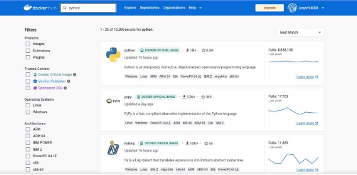
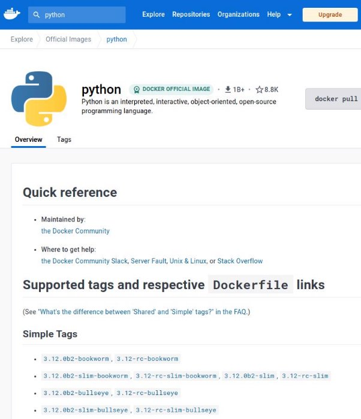
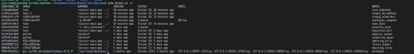
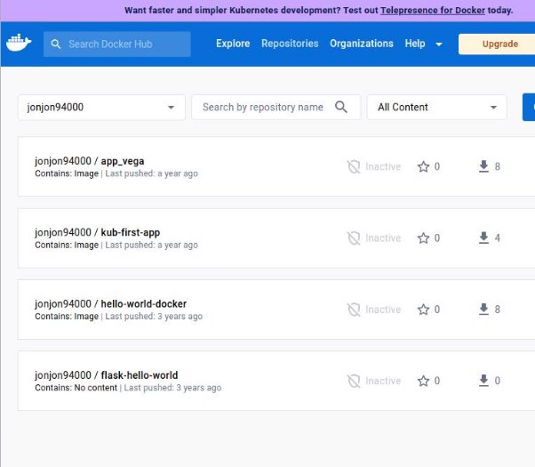
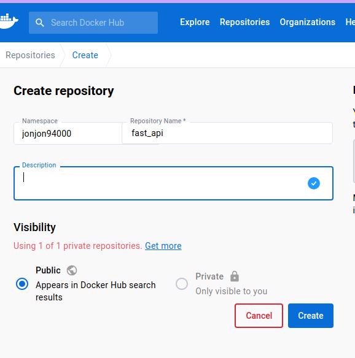
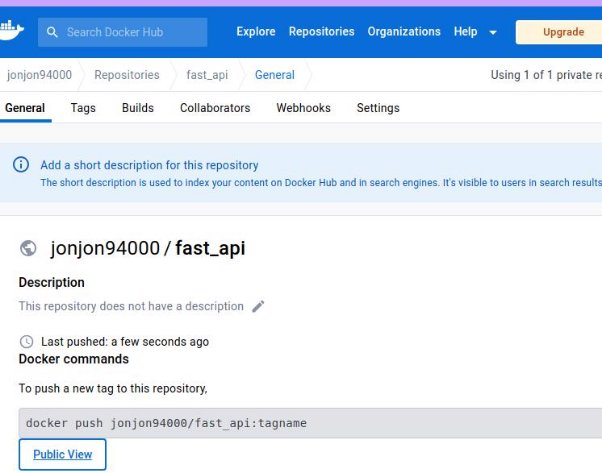
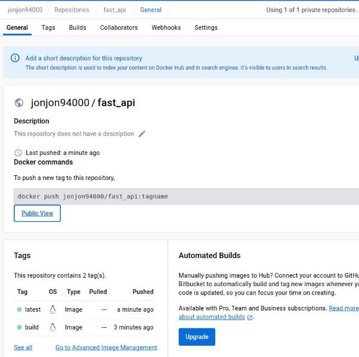

# Images & Conteneur

Comme on l’a vu, les conteneurs sont construits à partir d’images, dans la majorité des cas, nous utilisons une image pré-construite en base puis nous ajoutons nos fonctionnalité. Par exemple, dans l’exemple précédent, nous avons utilisé une image de python, ce qui signifie que nous avons un os (dans ce cas Linux) qui est construit de telle sorte qu'à ce que python fonctionne et par-dessus, nous ajoutons tous ce dont nous avons besson pour le bon fonctionnement de notre application.

Cependant, il existe un très grand nombre d’images pré-construites avec chacune ces spécificité et qui en fonction des usecases peuvent être importantes ou non.

Pour pouvoir les sélectionner, nous pouvons aller dans [dockerhub](https://hub.docker.com/)

après avoir créé un compte, vous pouvez chercher le type d’image que vous voulez Exemple [python](https://hub.docker.com/_/python) :



Une fois dans python, on peut voir les différentes images :



Ces image sont open-source et maintenu par les equipes officiel, on peut ici prendre la version de python que l’on veut.

avec cette commande ```docker run python``` docker va chercher la dernière image officiel de python dans dockerhub.


Point d’attention : ```Unable to find image 'python:latest' locally``` signifie que nous n’avons pas limage en local et donc docker va la chercher sur dockerhub. Bien sûr, sans Dockerfile pour ajouter les spécificité propre à nos usecases cette image ne sert à rien, mais ça devrait vous aider à mieux comprendre le principe.

La commande ```sudo docker ps -a``` à afficher tous les conteneurs qui ont été créés, qu’ils soient en activité ou non.


On peut aussi rendre nos conteneurs itératifs avec la commande suivante : ```sudo docker run -it python```

Bien sur si on veut être en mode itératif pour une image propre il faudra mettre son nom à la place de python

## Notre image

Regardons plus en détail ce qui compose notre image. Dockerfile

```
FROM python:3.9

WORKDIR /app COPY . /app/

RUN pip3 install -r requirements.txt

CMD ["uvicorn", "main:app", "--host", "0.0.0.0", "--port", "80"] 
```

```FROM python:3.9``` : Cela indique que notre image sera basée sur l'image officielle de Python version 3.9. C'est comme si nous avions choisi notre ingrédient principal pour notre recette.

```WORKDIR /app``` : Cette instruction définit le répertoire de travail (working directory) à /app. C'est l'endroit où nous allons placer nos fichiers et où les commandes suivantes seront exécutées. C'est comme si nous disions : "Travaillons dans le répertoire /app à partir de maintenant."

```COPY . /app/``` : Cette instruction copie tous les fichiers et dossiers du répertoire actuel (où se trouve le Dockerfile) vers le répertoire /app dans l'image Docker. C'est comme si nous prenions tous les ingrédients nécessaires pour notre recette et les plaçions dans le répertoire /app de notre image.

```RUN pip3 install -r requirements.txt``` : Cette instruction exécute la commande pip3 install -r requirements.txt à l'intérieur de l'image Docker. Elle installe les dépendances listées dans le fichier requirements.txt de notre application Python. C'est comme si nous ajoutions tous les assaisonnements et les ingrédients spécifiques à notre recette.

```CMD ["uvicorn", "main:app", "--host", "0.0.0.0", "--port", "80"]``` : Cette instruction définit la commande par défaut à exécuter lorsque le conteneur basé sur cette image est démarré. Elle indique d'exécuter la commande uvicorn main:app --host 0.0.0.0 --port 80. Cela lance l'application Python utilisant le framework Uvicorn, en écoutant sur l'hôte 0.0.0.0 et le port 80. C'est comme si nous disions : "Lorsque nous servons notre plat, nous voulons utiliser Uvicorn pour lancer l'application sur le port 80.

maintenant construisons notre image à nouveau mais avec un tag ```sudo docker build . -t fast```

puis

```sudo docker images```


comme on peut le voir notre image à désormais un nom (fast) car nous l’avons tagger, on peut y ajouter une version si l’on veut

```sudo docker build . -t fast:1```


Un nouveau repository fast c’est créé mais cette fois il y a le tag 1.

## Image layers

Nous allons voir en détail une fonctionnalité propre à docker. ```sudo docker build . -t fast:2```


Comme on peut le voir, pour la majorité des étapes de construction de l’image, il y a un cache qui est utilisé, ce qui fait que l’image est construite beaucoup plus rapidement. Pour comprendre ce comportement, il faut entrer plus en détail dans le concept d’image layers.

Une image est composée de plusieurs couches (layers) qui s'empilent les unes sur les autres pour former l'image finale. Chaque couche représente une modification ou une instruction spécifique appliquée à l'image. Par exemple, une couche peut contenir l'installation d'un logiciel, une autre couche peut contenir des fichiers de configuration, et ainsi de suite. Chaque fois que vous effectuez une modification ou une instruction lors de la création de l'image, une nouvelle couche est ajoutée à l'image existante.

L'avantage de cette approche par couches est qu'elle permet une gestion efficace des images Docker. Les couches sont stockées de manière indépendante, ce qui signifie que si vous apportez des modifications à une couche, seule cette couche spécifique doit être modifiée et téléchargée. Les couches immuables et réutilisables peuvent être partagées entre différentes images, ce qui réduit l'espace de stockage et facilite les mises à jour.

De plus, comme les couches sont empilées, Docker peut utiliser la mise en cache des couches précédentes lors de la création de nouvelles images. Cela accélère considérablement le processus de construction des images, car seules les nouvelles couches ou les couches modifiées doivent être reconstruites.

Arrêter et redémarrer les conteneurs.

Avant de voir comment arréter our redémarrer les conteneurs, nous devons être en mesure d’observer lesquelles sont en cours d’exécution ou non.


```sudo docker ps``` Permet d’afficher les conteneur en cours d’exécution.

WARNING : pour toute commande docker, il est important de garder à l’esprit que nous pouvons la commande ```--help``` pour connaître les options disponibles.


Comme on peut le voir, en ajoutant l’option a nous pouvons afficher tous les conteneurs, même ceux éteints.


Maintenant que nous connaissons les nom des conteneurs, nous pouvons les activer, essayons avec ```sudo docker run fast```.


Maintenant, nous pouvons observer les conteneurs en cours d’exécution.


WARNING : utilisez un nouveau terminal pour lancer la commande sans fermer l’ancien. Nous pouvons ensuite le stopper avec la commande ```sudo docker stop <NAMES>```


## Mode détaché

Quand nous lançons un conteneur, notre terminal peut se retrouver “bloqué” dans l’application, ce qui peut nous contraindre à utiliser un nouveau terminal.

Pour résoudre ce problème, nous pouvons lancer notre conteneur en mode “detached” pour cela, il suffit d’ajouter l’option -d.

```sudo docker run -p 80:80 -d fast```


Suppression d’image et de conteneurs

Nous avons vu comment arrêter les conteneur, mais si nous utilisons la commande ```sudo docker ps -a```, on peut voir qu’il existe toujours.



WARNING : On ne peut supprimer que les conteneur arrété (mesure de sécurité de la part de docker) si ce n’est pas le cas docker renverra une erreur.

La commande pour supprimer un container est ```sudo docker rm <NAMES>```


on peut aussi supprimer plusieurs conteneur avec la même commande


si nous voulons supprimer tous les conteneurs en une fois nous pouvons utiliser la commande suivante ```sudo docker rm -f $(sudo docker ps -aq)```


Maintenant, nous allons passer aux images, avant de pouvoir les supprimer nous devons les voir.

```sudo docker images```


ensuite nous pouvons supprimer l’images grâce à ```sudo docker rmi <IMAGE\_ID>


WARNING : les conteneurs utilisant l’image doivent être supprimés sinon docker lèvera une erreur (mesure de sécurité)

## Nommer et tagger les conteneur et images

pour rappel quand il s’agit d’une image nous pouvons la nommer avec la commande -t (Ex : ```sudo docker build . -t fast```) nous pouvons également ajouter des versions en ajoutant :NUMERO (Ex : ```sudo docker build . -t fast:1 ```) même si nous ne somme pas dans l’obligation de mettre un nombre dessus.

ps : pour être plus précis, nous appelons la version le tag (le format est name:tag) mais nous préférons utiliser le mot version car dans la majorité des cas c’est dans ce sens que nous utilisons le tag

pour les image nous devons utiliser l’option –name ```sudo docker run -d --name fast\_container fast```


## DockerHub

Toutes les images de base que nous avons pris de base pour construire nos Dockerfiles sont issues de Dockerhub, c’est un peu comme github mais dédié au docker, cependant nous ne sommes uniquement dans un registre de “pull” nous pouvons aussi pusher des images pour qu’elles soient disponibles aux public, ou les rendres privé pour que nous soyons les seuls à y avoir accés ou d’autres personnes (ex : notre équipe de développement).

Vérifiez que vous avez bien l’image fast :


créer un compte sur dockerhub

Allez dans repositories :



puis dans create repository :




Vous devriez arriver sur cette image :



L’image n’existe pas en local nous pour soit renommer une image existante : ```sudo docker tag fast jonjon94000/fast\_api```

ou en recréer une avec le bon tag :

```sudo docker build . -t jonjon94000/fast\_api:build``` (build sert à faire la distinction)


Avant de pusher l’image vous devez être sur de bien être identifié :

```sudo docker login```

WARNING : utiliser l’indentifiant et le mot de passe créé lors de la création de compte

puis :

```sudo docker push jonjon94000/fast\_api:build```


on peut également essayer pour la deuxième image : ```sudo docker push jonjon94000/fast\_api:latest```


Normalement, vous devriez voir vos images


