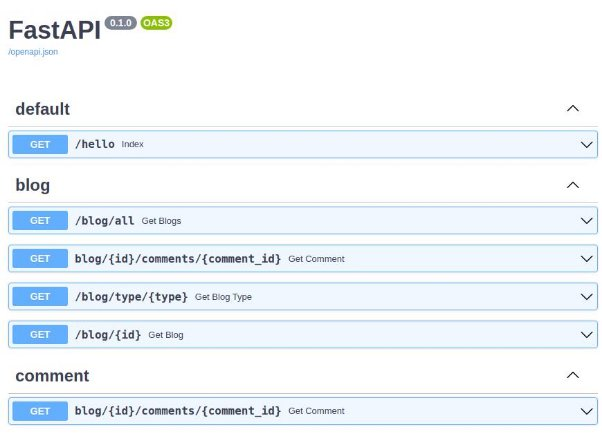

# Operation description

## Status code

Le status code, permet d’identifier le résultat d’une opération, il en existe plusieurs types :

- 1xx Réponse d'information - la demande a été reçue, poursuite du processus
- 2xx réussi - la demande a été reçue, comprise et acceptée avec succès
- 3xx Redirection - d'autres mesures doivent être prises afin de compléter la demande
- 4xx Erreur client - la demande contient une mauvaise syntaxe ou ne peut pas être satisfaite
- 5xx Erreur de serveur - le serveur n'a pas réussi à répondre à une demande apparemment valide

pour plus d’information sur la liste des [status code ](https://en.wikipedia.org/wiki/List_of_HTTP_status_codes)Regardons un exemple :

[main.py](status_code/main.py)

```python
from typing import Optional
from fastapi import FastAPI, Response, status
from enum import Enum


app = FastAPI()

@app.get('/hello')
def index():
  return {'message': 'Hello world!'}

# @app.get('/blog/all')
# def get_all_blogs():
#   return {'message': 'All blogs provided'}

@app.get('/blog/all')
def get_blogs(page = 1, page_size: Optional[int] = None):
  return {'message': f'All {page_size} blogs on page {page}'}

@app.get('blog/{id}/comments/{comment_id}')
def get_comment(id: int, comment_id: int, valid: bool = True, username: Optional[str] = None):
  return {'message': f'blog_id {id}, comment_id {comment_id}, valid {valid}, username {username}'}

class BlogType(str, Enum):
    short = 'short'
    story = 'story'
    howto = 'howto'

@app.get('/blog/type/{type}')
def get_blog_type(type: BlogType):
  return {'message': f'Blog type {type}'}

@app.get('/blog/{id}', status_code=status.HTTP_200_OK)
def get_blog(id: int, response: Response):
  if id > 5:
    response.status_code = status.HTTP_404_NOT_FOUND
    return {'error': f'Blog {id} not found'}
  else : 
    response.status_code = status.HTTP_200_OK
    return {'message': f'Blog with id {id}'}
```

La partie qui nous intéresse :

```python
@app.get('/blog/{id}', status_code=status.HTTP_200_OK, tags=['blog'])
def get_blog(id: int, response: Response):
  if id > 5:
    response.status_code = status.HTTP_404_NOT_FOUND
    return {'error': f'Blog {id} not found'}
  else : 
    response.status_code = status.HTTP_200_OK
    return {'message': f'Blog with id {id}'}
```


(ne pas oublier les importations : from fastapi import FastAPI, Response, status)

- le module status contient tous les status ce qui nous permet de ne pas à avoir à tous nous les rappeler
- Response permet de gérer les response qui sont automatiquement généré par fastapi, ce qui nous permet de catcher les erreurs et de les gérer comme nous l’entendons

## Tags

Les tags permettent de mieux structure notre code. 

Exemple :

[main.py](tags/main.py)

```python
from typing import Optional
from fastapi import FastAPI, Response, status
from enum import Enum


app = FastAPI()

@app.get('/hello')
def index():
  return {'message': 'Hello world!'}

# @app.get('/blog/all')
# def get_all_blogs():
#   return {'message': 'All blogs provided'}

@app.get(
  '/blog/all',
  tags=['blog']
  )
def get_blogs(page = 1, page_size: Optional[int] = None):
  return {'message': f'All {page_size} blogs on page {page}'}

@app.get('blog/{id}/comments/{comment_id}', tags=['blog', 'comment'])
def get_comment(id: int, comment_id: int, valid: bool = True, username: Optional[str] = None):
  return {'message': f'blog_id {id}, comment_id {comment_id}, valid {valid}, username {username}'}

class BlogType(str, Enum):
    short = 'short'
    story = 'story'
    howto = 'howto'

@app.get('/blog/type/{type}', tags=['blog'])
def get_blog_type(type: BlogType):
  return {'message': f'Blog type {type}'}

@app.get('/blog/{id}', status_code=status.HTTP_200_OK, tags=['blog'])
def get_blog(id: int, response: Response):
  if id > 5:
    response.status_code = status.HTTP_404_NOT_FOUND
    return {'error': f'Blog {id} not found'}
  else : 
    response.status_code = status.HTTP_200_OK
    return {'message': f'Blog with id {id}'}
```

Dans cet exemple nous avons tagger tous nos endpoints pour qu’il y ai plus de semantique (get_blogs à le tag blog), de plus une fonction peut avoir plusieurs tags (get_comment à les tags blog et comment)



## Summary and description

Pour chaque endpoint, nous pouvons ajouter des sommaires est des description dans le swagger/redoc pour que les utilisateurs n’aient pas de mal à utiliser l’api. Il y a deux mpanière de faire celà.

La première méthode consiste à utiliser le app.get et d’indiquer directement les informations Exemple :

[main.py](summary_description/main.py)

```python
from typing import Optional
from fastapi import FastAPI, Response, status
from enum import Enum


app = FastAPI()

@app.get('/hello')
def index():
  return {'message': 'Hello world!'}

# @app.get('/blog/all')
# def get_all_blogs():
#   return {'message': 'All blogs provided'}

@app.get(
  '/blog/all',
  tags=['blog'],
    summary='Retrieve all blogs',
    description='This api call simulates fetching all blogs'
  )
def get_blogs(page = 1, page_size: Optional[int] = None):
  return {'message': f'All {page_size} blogs on page {page}'}

@app.get('blog/{id}/comments/{comment_id}', tags=['blog', 'comment'])
def get_comment(id: int, comment_id: int, valid: bool = True, username: Optional[str] = None):
  """
    Simulates retrieving a comment of a blog
    - **id** mandatory path parameter
    - **comment_id** mandatory path parameter
    - **bool** optional query parameter
    - **username** optional query parameter
    """
  return {'message': f'blog_id {id}, comment_id {comment_id}, valid {valid}, username {username}'}

class BlogType(str, Enum):
    short = 'short'
    story = 'story'
    howto = 'howto'

@app.get('/blog/type/{type}', tags=['blog'])
def get_blog_type(type: BlogType):
  return {'message': f'Blog type {type}'}

@app.get('/blog/{id}', status_code=status.HTTP_200_OK, tags=['blog'])
def get_blog(id: int, response: Response):
  if id > 5:
    response.status_code = status.HTTP_404_NOT_FOUND
    return {'error': f'Blog {id} not found'}
  else : 
    response.status_code = status.HTTP_200_OK
    return {'message': f'Blog with id {id}'}
```

La partie qui nous intéresse : 

```python
@app.get('blog/{id}/comments/{comment_id}', tags=['blog', 'comment'])
def get_comment(id: int, comment_id: int, valid: bool = True, username: Optional[str] = None):
  """
    Simulates retrieving a comment of a blog
    - **id** mandatory path parameter
    - **comment_id** mandatory path parameter
    - **bool** optional query parameter
    - **username** optional query parameter
    """
  return {'message': f'blog_id {id}, comment_id {comment_id}, valid {valid}, username {username}'}
```


## Response description

Les responses description ont la même utilité que les sommaire et description vu précédemment mais à une échelle

[main.py](response_description/main.py)

```python
from typing import Optional
from fastapi import FastAPI, Response, status
from enum import Enum


app = FastAPI()

@app.get('/hello')
def index():
  return {'message': 'Hello world!'}

# @app.get('/blog/all')
# def get_all_blogs():
#   return {'message': 'All blogs provided'}

@app.get(
  '/blog/all',
  tags=['blog'],
    summary='Retrieve all blogs',
    description='This api call simulates fetching all blogs',
    response_description="The list of available blogs"
  )
def get_blogs(page = 1, page_size: Optional[int] = None):
  return {'message': f'All {page_size} blogs on page {page}'}

@app.get('blog/{id}/comments/{comment_id}', tags=['blog', 'comment'])
def get_comment(id: int, comment_id: int, valid: bool = True, username: Optional[str] = None):
  """
    Simulates retrieving a comment of a blog
    - **id** mandatory path parameter
    - **comment_id** mandatory path parameter
    - **bool** optional query parameter
    - **username** optional query parameter
    """
  return {'message': f'blog_id {id}, comment_id {comment_id}, valid {valid}, username {username}'}

class BlogType(str, Enum):
    short = 'short'
    story = 'story'
    howto = 'howto'

@app.get('/blog/type/{type}', tags=['blog'])
def get_blog_type(type: BlogType):
  return {'message': f'Blog type {type}'}

@app.get('/blog/{id}', status_code=status.HTTP_200_OK, tags=['blog'])
def get_blog(id: int, response: Response):
  if id > 5:
    response.status_code = status.HTTP_404_NOT_FOUND
    return {'error': f'Blog {id} not found'}
  else : 
    response.status_code = status.HTTP_200_OK
    return {'message': f'Blog with id {id}'}
```

La partie qui nous intéresse :

```python
@app.get(
  '/blog/all',
  tags=['blog'],
    summary='Retrieve all blogs',
    description='This api call simulates fetching all blogs',
    response_description="The list of available blogs"
  )
def get_blogs(page = 1, page_size: Optional[int] = None):
  return {'message': f'All {page_size} blogs on page {page}'}
```


