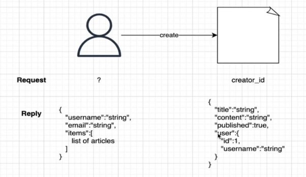

# FastApi & SQLAlchemy

Il peut arriver des moment où l’on peut avoir envie de stocker certaines informations de nos requêtes, dans ces moments, il faudra coupler une base de données avec FastApi.

## Introduction au dépendances

Nous entrerons plus en détail dans les dépendances dans le prochain cours, cependant pour utiliser les base de données avec FastApi, nous devons avoir une compréhension sommaire de ce que sont les dépendances. Les dépendances sont un moyen de faire en sorte qu’une fonction dépende d’une autre fonction. Les dépendances sont aussi un moyen de rendre les fonctions portables, nous l’écrivons une fois et pouvons l’utiliser où nous voulons de manière très simple.

[blog_post.py](intro_dependencies/router/blog_post.py)

```python
from typing import Optional, List, Dict
from fastapi import APIRouter, Query, Body, Path
from pydantic import BaseModel

router = APIRouter(
    prefix='/blog',
    tags=['blog']
)

class Image(BaseModel):
    url: str
    alias: str

class BlogModel(BaseModel):
    title: str
    content: str
    nb_comments: int
    published: Optional[bool]
    tags: List[str] = []
    metadata: Dict[str, str] = {'key1': 'val1'}
    image: Optional[Image] = None

@router.post('/new/{id}')
def create_blog(blog: BaseModel, id: int, version: int = 1):
  return {
    'id': id,
    'data': blog,
    'version': version
    }

@router.post('/new/{id}/comment/{comment_id}')
def create_comment(blog: BlogModel, id: int, 
        comment_title: int = Query(None,
            title='Title of the comment',
            description='Some description for comment_title',
            alias='commentTitle',
            deprecated=True
        ),
        content: str = Body(...,
            min_length=10,
            max_length=50,
            regex='^[a-z\s]*$'
        ),
        v: Optional[List[str]] = Query(['1.0', '1.1', '1.2']),
        comment_id: int = Path(..., le=5)
    ):
    return {
        'blog': blog,
        'id': id,
        'comment_title': comment_title,
        'content': content,
        'version': v,
        'comment_id': comment_id
    }

def required_functionality():
  return {'message': 'Learning FastAPI is important'}
```
La fonction required_functionality() sera la fonction à laquelle les endpoints de seront dépendant. 

[blog_get.py](intro_dependencies/router/blog_get.py)

```python
from router.blog_post import required_functionality
from fastapi import APIRouter, Response, status, Depends
from enum import Enum
from typing import Optional

router = APIRouter(
    prefix='/blog',
    tags=['blog']
)

# @app.get('/all')
# def get_all_blogs():
#   return {'message': 'All blogs provided'}

@router.get(
  '/all',
  summary='Retrieve all blogs',
  description='This api call simulates fetching all blogs',
  response_description="The list of available blogs"
  )
def get_blogs(page = 1, page_size: Optional[int] = None, req_parameter: dict = Depends(required_functionality)):
  return {'message': f'All {page_size} blogs on page {page}', 'req': req_parameter}

@router.get('/{id}/comments/{comment_id}', tags=['comment'])
def get_comment(id: int, comment_id: int, valid: bool = True, username: Optional[str] = None, req_parameter: dict = Depends(required_functionality)):
  """
    Simulates retrieving a comment of a blog
    - **id** mandatory path parameter
    - **comment_id** mandatory path parameter
    - **bool** optional query parameter
    - **username** optional query parameter
    """
  return {'message': f'blog_id {id}, comment_id {comment_id}, valid {valid}, username {username}'}

class BlogType(str, Enum):
  short = 'short'
  story = 'story'
  howto = 'howto'

@router.get('/type/{type}')
def get_blog_type(type: BlogType, req_parameter: dict = Depends(required_functionality)):
  return {'message': f'Blog type {type}'}

@router.get('/{id}', status_code=status.HTTP_200_OK)
def get_blog(id: int, response: Response, req_parameter: dict = Depends(required_functionality)):
  if id > 5:
    response.status_code = status.HTTP_404_NOT_FOUND
    return {'error': f'Blog {id} not found'}
  else : 
    response.status_code = status.HTTP_200_OK
    return {'message': f'Blog with id {id}'}
```

La librairie Depends permet de définir la dépendance comme on le voit la majorité des endpoints sont dépendant de la fonction required_functionality

## Création de base de données

Tout d’abord nous allons entrer en détail dans le code de création de base de données (installer bien les dépendances de requirements.txt dans votre environnement virtuel)

[database.py](database_fastapi/db/database.py)

```python
from sqlalchemy import create_engine
from sqlalchemy.ext.declarative import declarative_base
from sqlalchemy.orm import sessionmaker

SQLALCHEMY_DATABASE_URL = "sqlite:///./fastapi-test.db"

engine = create_engine(
    SQLALCHEMY_DATABASE_URL, connect_args={"check_same_thread": False}
)
SessionLocal = sessionmaker(autocommit=False, autoflush=False, bind=engine)

Base = declarative_base()

def get_db():
    db = SessionLocal()
    try:
        yield db
    finally:
        db.close()
```

- SQLALCHEMY_DATABASE_URL : est le nom de la base de données, il est au choix de l’utilisateur
- Base : Est la variable que nous utiliseront pour créer notre modèle plus tard das notre code get_db : cette fonction permettra d’intéragir avec la base de données pour toute nos opération et de la fermer après utilisation

[models.py](database_fastapi/db/models.py)

```python
from .database import Base
from sqlalchemy import Column, Integer, String


class DbUser(Base):
  __tablename__ = 'users'
  id = Column(Integer, primary_key=True, index=True)
  username = Column(String)
  email = Column(String)
  password = Column(String)
```

Ici nous créons notre model pour que notre base de données/table sache à quoi s’attendre comme type de données.

[models.py](datamodelsbase_fastapi/main.py)


```python
from typing import Optional
from fastapi import FastAPI
from router import blog_get
from router import blog_post
from db.database import engine
from db import models


app = FastAPI()
app.include_router(blog_get.router)
app.include_router(blog_post.router)

@app.get('/hello')
def index():
  return {'message': 'Hello world!'}

models.Base.metadata.create_all(engine)
```

La partie importante ici est models.Base.metadata.create_all(engine) ou nous ferons interagir model et engine que nous avons tout les deux implémentés.

installation de [tableplus](https://tableplus.com/blog/2019/10/tableplus-linux-installation.html)

## Write data in database

Maintenons que nous avons vu comment créer une base de données, nous allons voir comment écrire dedans.

Rappel :

- Définition de base de données : database.py
- Définition du modèle : models.py
- Création de base de donées : main.py

Nouveau :

- Définition du schéma : schemas.py
- ORM définition : db_user.py
- Fonctionnalité de l’Api : user.py

[schema.py](write_data/schemas.py)

```python
from pydantic import BaseModel


class UserBase(BaseModel):
  username: str
  email: str
  password: str

class UserDisplay(BaseModel):
  username: str
  email: str
  class Config():
    orm_mode = True
```

UserDisplay permet de renvoyer les données que nous voulons à l’utilisateur, comme on peut le voir il n’y a pas de password de cette dataclass, ce qui nou permet de ne pas montrer le mot de passe à tout le monde même s'il est hasher.

la class Config avec l’attribut orm_mode à true permet de retourner les données au format choisi sans que nous ayons d’erreur (on retourne le username et l’email, nous devrions également prendre le password pour ne pas provoquer d’erreur mais orm_mode gère ça pour nous)

[db_user.py](write_data/db/db_user.py)

```python
from db.hash import Hash
from sqlalchemy.orm.session import Session
from schemas import UserBase
from db.models import DbUser


def create_user(db: Session, request: UserBase):
  new_user = DbUser(
    username = request.username,
    email = request.email,
    password = Hash.bcrypt(request.password)
  )
  db.add(new_user)
  db.commit()
  db.refresh(new_user)
  return new_user
```

le password doit être hasher pour des raison de sécurité d’où l’utilisation de Hash que nous implémentons dans hash.py.

- add permet d’ajouter l’utilisateur
- commit d’enregitrer les opération effectué
- refresh permet de mettre à jout les données qui sont généré automatiquement dans la base de données comme l’id (primary key)

[hash.py](write_data/db/hash.py)

```python
from passlib.context import CryptContext

pwd_cxt = CryptContext(schemes=['bcrypt'], deprecated="auto")

class Hash():
    def bcrypt(password: str):
        return pwd_cxt.hash(password)

    def verify(hashed_password, plain_password):
        return pwd_cxt.verify(plain_password, hashed_password)
```

Ici, nous avons une classe qui permet de faire deux types d’opération :

- bcrypt hash les mot de passe, en effet quand un mot de passe est créée, on utilise une version hasher pour empêcher des personne mal intentionnée de le voir en clair et de pouvoir s’identifier
- verify va vérifier si le mot de passe en hasher est bien la valeur que nous attendons.

[user.py](write_data/router/user.py)

```python
from schemas import UserBase, UserDisplay
from fastapi import APIRouter, Depends
from sqlalchemy.orm import Session
from db.database import get_db
from db import db_user


router = APIRouter(
  prefix='/user',
  tags=['user']
)

# Create user
@router.post('/', response_model=UserDisplay)
def create_user(request: UserBase, db: Session = Depends(get_db)):
  return db_user.create_user(db, request)
```

Pour le moment les codes est relativement simple à comprendre, on crée une dépendance avec la fonction qui retourne la session de la base de données.

## Create and read

[db_user.py](create_and_read/db/db_user.py)

```python
from db.hash import Hash
from sqlalchemy.orm.session import Session
from schemas import UserBase
from db.models import DbUser


def create_user(db: Session, request: UserBase):
  new_user = DbUser(
    username = request.username,
    email = request.email,
    password = Hash.bcrypt(request.password)
  )
  db.add(new_user)
  db.commit()
  db.refresh(new_user)
  return new_user

def get_all_users(db: Session):
  return db.query(DbUser).all()

def get_user(db: Session, id: int):
  return db.query(DbUser).filter(DbUser.id == id).first()
```

Ici nous avons ajouté deux fonctions pour la lecture :

- get_all_users va lire toutes les données de notre base (ne pas oublier que DbUser permet d’indiquer la table à lire)
- get_user va permettre de retourner les données mais cette fois avec la possibilité de filtrer sur une ou des colonne(s) (ici sur id)

[user.py](create_and_read/router/user.py)
```python
from typing import List
from schemas import UserBase, UserDisplay
from fastapi import APIRouter, Depends
from sqlalchemy.orm import Session
from db.database import get_db
from db import db_user


router = APIRouter(
  prefix='/user',
  tags=['user']
)

# Create user
@router.post('/', response_model=UserDisplay)
def create_user(request: UserBase, db: Session = Depends(get_db)):
  return db_user.create_user(db, request)

# Read all users
@router.get('/', response_model=List[UserDisplay])
def get_all_users(db: Session = Depends(get_db)):
  return db_user.get_all_users(db)

# Read one user
@router.get('/{id}', response_model=UserDisplay)
def get_user(id: int, db: Session = Depends(get_db)):
  return db_user.get_user(db, id)
```

Nous avons ajouter deux fonctions :

- get_all_users : qui permet d’accéder à tous les utilisateurs
- get_user : qui permet d’accéder à un utilisateur rn fonction de l’id

étant donné que toute la logique est stockée dans le module db_user la seule chose à retenir et la création de dépendance pour que la fonction en s’active qu’une fois que nous ayons accès à la base de données.

## Update and read

Ici nous allons voir comment modifier et supprimé les données d’un utilisateur db_user.py

[db_user.py](update_and_create/db/db_user.py)

```python
from db.hash import Hash
from sqlalchemy.orm.session import Session
from schemas import UserBase
from db.models import DbUser


def create_user(db: Session, request: UserBase):
  new_user = DbUser(
    username = request.username,
    email = request.email,
    password = Hash.bcrypt(request.password)
  )
  db.add(new_user)
  db.commit()
  db.refresh(new_user)
  return new_user

def get_all_users(db: Session):
  return db.query(DbUser).all()

def get_user(db: Session, id: int):
  return db.query(DbUser).filter(DbUser.id == id).first()

def update_user(db: Session, id: int, request: UserBase):
  user = db.query(DbUser).filter(DbUser.id == id)
  user.update({
    DbUser.username: request.username,
    DbUser.email: request.email,
    DbUser.password: Hash.bcrypt(request.password)
  })
  db.commit()
  return 'ok'

def delete_user(db: Session, id: int):
  user = db.query(DbUser).filter(DbUser.id == id).first()
  db.delete(user)
  db.commit()
  return 'ok'
```

ici nous avons deux fonctions qui gèrent les nouvelles logiques :

- update_user : à partir d’une requête fournie pas l’utilisateur, nous aurons les différentes nouvelle valeur à mettre à jour en fonction de chaque colonne en fonction d’un id
- delete_user : permet en fonction d’un id de supprimer un utilisateur dans la base de données

point d’attention : ne pas oublier le commit pour que les opérations soient enregistrées par la base de données

Maintenons, intégrons la logique à notre api.

[user.py](update_and_create/router/user.py)
```python
from typing import List
from schemas import UserBase, UserDisplay
from fastapi import APIRouter, Depends
from sqlalchemy.orm import Session
from db.database import get_db
from db import db_user


router = APIRouter(
  prefix='/user',
  tags=['user']
)

# Create user
@router.post('/', response_model=UserDisplay)
def create_user(request: UserBase, db: Session = Depends(get_db)):
  return db_user.create_user(db, request)

# Read all users
@router.get('/', response_model=List[UserDisplay])
def get_all_users(db: Session = Depends(get_db)):
  return db_user.get_all_users(db)

# Read one user
@router.get('/{id}', response_model=UserDisplay)
def get_user(id: int, db: Session = Depends(get_db)):
  return db_user.get_user(db, id)

# Update user
@router.post('/{id}/update')
def update_user(id: int, request: UserBase, db: Session = Depends(get_db)):
  return db_user.update_user(db, id, request)

# Delete user
@router.get('/delete/{id}')
def delete(id: int, db: Session = Depends(get_db)):
  return db_user.delete_user(db, id)
```

## Relationship

Ici, nous allons voir comment lier plusieurs table entre eux pour retrouver plusieurs niveaux d’information en une seule requête.

[model.py](relationship/db/models.py)
```python
from sqlalchemy.orm import relationship
from sqlalchemy.sql.schema import ForeignKey
from sqlalchemy.sql.sqltypes import Integer, String, Boolean
from db.database import Base
from sqlalchemy import Column


class DbUser(Base):
  __tablename__ = 'users'
  id = Column(Integer, primary_key=True, index=True)
  username = Column(String)
  email = Column(String)
  password = Column(String)
  items = relationship('DbArticle', back_populates='user')

class DbArticle(Base):
  __tablename__= 'articles'
  id = Column(Integer, primary_key=True, index=True)
  title = Column(String)
  content = Column(String)
  published = Column(Boolean)
  user_id = Column(Integer, ForeignKey('users.id'))
  user = relationship("DbUser", back_populates='items')
```

il y a deux nouveaux élément dans notre modèle :

- Column(Integer, ForeignKey('users.id')) : permet de préciser à notre base de données qu’il s’agit d’une clé étrangère
- relationship : permet d’identifier pour un attribut où il doit chercher la donnée provenant d’une autre table (nous pourrions le faire de manière manuel, mais ça réduit la complexité de l’application)
  - items : cette “relationship” va permettre de retrouver la liste des articles en fonction d’un utilisateur
  - user : cette “relationship” va permettre de retrouver l’ensemble des information d’un user par rapport à un article




Regardons le schéma plus en détail : 

[schemas.py](relationship/schemas.py)

```python
from typing import List
from pydantic import BaseModel

# Article inside UserDisplay
class Article(BaseModel):
  title: str
  content: str
  published: bool
  class Config():
    orm_mode = True

class UserBase(BaseModel):
  username: str
  email: str
  password: str

class UserDisplay(BaseModel):
  username: str
  email: str
  items: List[Article] = []
  class Config():
    orm_mode = True

# User inside ArticleDisplay
class User(BaseModel):
  id: int
  username: str
  class Config():
    orm_mode = True

class ArticleBase(BaseModel):
  title: str
  content: str
  published: bool
  creator_id: int

class ArticleDisplay(BaseModel):
  title: str
  content: str
  published: bool
  user: User
  class Config():
    orm_mode = True
```

Il y a trois grande composante pour article et user:

- le modèle classique qui permettra d’enregistrer les données (pas de mode orm car nous voulons toutes les données)
- le modèle qui sera intégré à display (il n’a pas vocation à être renvoyé tout seul) par exemple :

```python
class Article(BaseModel):
  title: str
  content: str
  published: bool
  class Config():
    orm_mode = True
```

qui sera intégré à :

```python
class UserDisplay(BaseModel):
  username: str
  email: str
  items: List[Article] = []
  class Config():
    orm_mode = True
```
- le modèle display (ce que nous voulons montrer à l’utilisateur)

Nous allons coder la logique de récupération de données pour article comme nous l’avons fait pour db_user.py

[db_article.py](relationship/db/db_article.py)

```python
from sqlalchemy.orm.session import Session
from db.models import DbArticle
from schemas import ArticleBase


def create_article(db: Session, request: ArticleBase):
  new_article = DbArticle(
    title = request.title,
    content = request.content,
    published = request.published,
    user_id = request.creator_id
  )
  db.add(new_article)
  db.commit()
  db.refresh(new_article)
  return new_article

def get_article(db: Session, id: int):
  article = db.query(DbArticle).filter(DbArticle.id == id).first()
  # Handle errors
  return article
```

Comme pour user.py nous devons créer l’équivalent pour article, c’est relativement simple car la logique de récupération des données a déjà était faites dans db_article.py.

[article.py](relationship/router/article.py)
```python
from typing import List
from schemas import ArticleBase, ArticleDisplay, UserBase
from fastapi import APIRouter, Depends
from sqlalchemy.orm import Session
from db.database import get_db
from db import db_article

router = APIRouter(
  prefix='/article',
  tags=['article']
)

# Create article
@router.post('/', response_model=ArticleDisplay)
def create_article(request: ArticleBase, db: Session = Depends(get_db)):
  return db_article.create_article(db, request)

# Get specific article
@router.get('/{id}') #, response_model=ArticleDisplay)
def get_article(id: int, db: Session = Depends(get_db)):
  return {
    'data': db_article.get_article(db, id)
  }
```